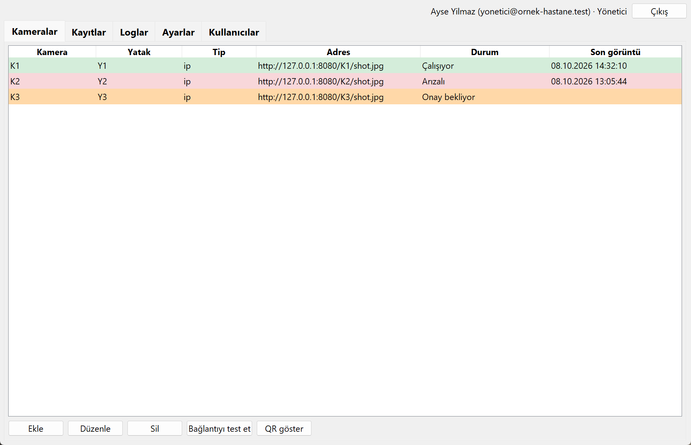
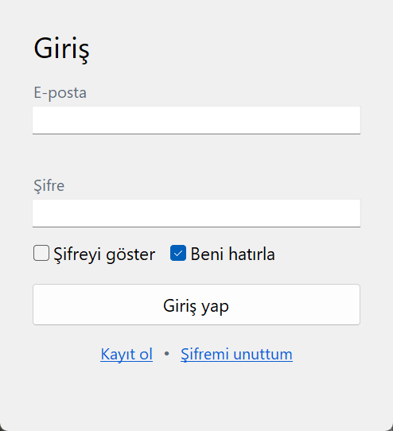
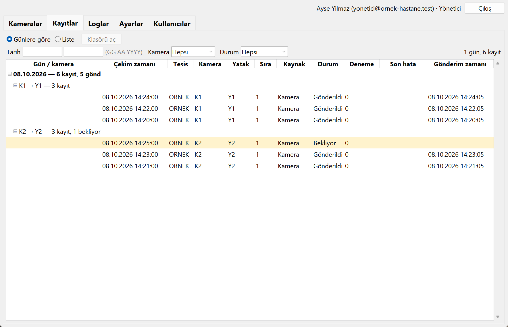
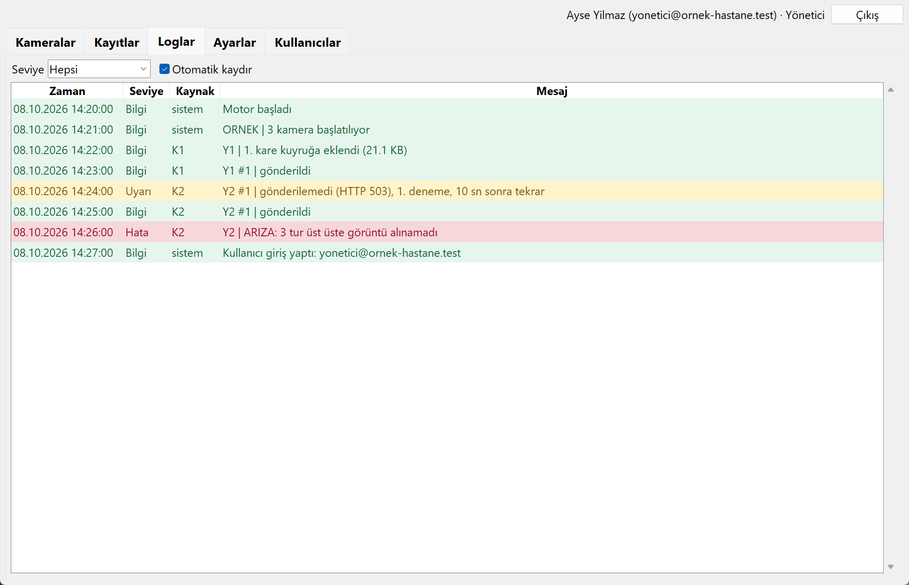
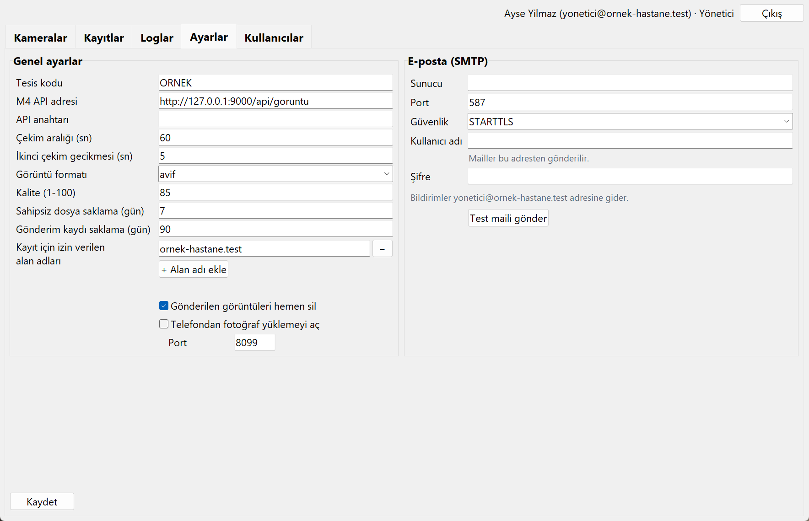
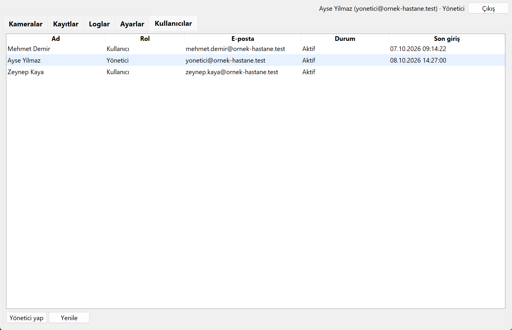

# Monitör Görüntü Aktarımı

Yoğun bakımdaki hasta başı monitörlerin çoğunda dijital veri çıkışı yoktur; değerler hemşire
tarafından elle deftere yazılır. Bu uygulama monitör ekranlarını IP kameralarla belirli
aralıklarla fotoğraflar, görüntüyü kamera–yatak eşleşmesiyle etiketler ve hastanenin M4 (HBYS)
sistemine otomatik gönderir. Ağ ya da API geçici olarak çalışmazsa görüntüler yerelde kuyruğa
alınır ve artan aralıklarla yeniden denenir; hiçbir çekim kaybolmaz.



---

## İçindekiler

- [Özellikler](#özellikler)
- [Nasıl çalışır](#nasıl-çalışır)
- [Ekranlar](#ekranlar)
- [Hızlı başlangıç](#hızlı-başlangıç)
- [Klasör yapısı](#klasör-yapısı)
- [Geliştiriciler için](#geliştiriciler-için)
- [Güvenlik](#güvenlik)
- [Bilinen sınırlar](#bilinen-sınırlar)

---

## Özellikler

| | |
|---|---|
| **Çift çekim** | Her turda iki kare alınır; biri bulanık çıkarsa diğeri kullanılabilir. |
| **Kuyruk ve tekrar deneme** | Gönderilemeyen görüntü SQLite kuyruğunda bekler, artan aralıklarla yeniden denenir. Kalıcı hata `hatali` olarak işaretlenir. |
| **Kamera onayı** | Yeni kamera, e-posta ile gelen 6 haneli kod girilene kadar görüntü çekmez. Onaysız kamera motorda çalışmaz. |
| **Kullanıcı hesapları** | E-posta doğrulamalı giriş, yönetici/kullanıcı ayrımı, hatalı denemede hesap kilidi. |
| **Kamera sahipliği** | Kamerayı ekleyen kişi onun sahibidir. Normal kullanıcı yalnızca kendi kameralarını, kayıtlarını ve loglarını görür; yönetici hepsini görür. |
| **Arıza bildirimi** | Kamera üst üste yanıt vermezse e-posta gider; düzelince ikinci bir e-posta gelir. |
| **Telefonla fotoğraf** | Yatak başındaki QR kod okutularak telefondan fotoğraf yüklenebilir. Varsayılan **kapalı**. |
| **Tek program açarsınız** | Yalnızca *Monitör Görüntü Aktarımı*'nı açarsınız; arka plan motorunu o başlatır. Pencereyi kapatınca motor çalışmaya devam eder. |
| **Otomatik temizlik** | Gönderilen görüntüler ve eski kayıtlar ayarlanan süre sonunda silinir. |
| **Yerel test ortamı** | Gerçek kamera ve gerçek M4 olmadan uçtan uca denenebilir ([araclar/](araclar/)). |

## Nasıl çalışır

Uygulama **iki ayrı programdır**. Aynı klasörde dururlar, aynı ayar dosyasını ve aynı
veritabanını paylaşırlar, ama birbirinden bağımsız çalışırlar: arayüz kapalıyken motor çekim
yapmaya devam eder.

```
   IP kameralar                                                M4 (HBYS) API
        │                                                            ▲
        │ HTTP snapshot                                      HTTPS   │
        ▼                                                            │
   ┌─────────────┐                                                   │
   │  motor.exe  │ ── çeker ──► kaydeder ──► kuyruğa alır ── gönderir ┘
   │ (penceresiz)│                                  │
   └──────┬──────┘                                  │ başarısızsa
          │                                         └─► tekrar dener
          │ okur/yazar
          ▼
   ┌───────────────────────────┐          ┌──────────────┐
   │ config/ayarlar.json       │◄────────►│  arayuz.exe  │
   │ veri/monitor.db (SQLite)  │          │  (Tkinter)   │
   │ durum.json                │          └──────────────┘
   └───────────────────────────┘           ayar girer, kamera yönetir,
                                           durum / kayıt / log izler
```

- **`motor.exe`** — penceresi yoktur, arka planda sürekli çalışır. Kameralardan görüntü çeker,
  diske kaydeder, kuyruğa alır, M4'e gönderir, başarısız olanı tekrar dener, eski dosyaları
  temizler ve arıza e-postalarını yollar. Görev Zamanlayıcı ile açılışta başlatılır.
- **`arayuz.exe`** — kullanıcının açtığı tek program (masaüstünde *Monitör Görüntü Aktarımı*).
  Ayar girişi, kamera ekleme/düzenleme, bağlantı testi, kamera durumu, gönderim kayıtları ve
  olay günlüğü buradadır.

**Motoru arayüz yönetir.** Arayüz açılınca motorun çalışıp çalışmadığına bakar; çalışmıyorsa
penceresiz başlatır, çalışıyorsa ikinci kopya açmaz. İkisi ayrı süreç olduğu için **arayüzü
kapatmak motoru durdurmaz** — görüntü çekimi sürer. Üst çubuktaki gösterge durumu söyler
(*Motor çalışıyor ●* / *Motor durdu ●*); yöneticiler oradaki düğmeyle elle başlatıp
durdurabilir. Ayarlar'daki **"Bilgisayar açılınca motoru başlat"** kutusu işaretlenirse motor
siz hiçbir şey açmadan da başlar.

Motor, ayar dosyasındaki değişikliği 5 saniye içinde kendisi fark eder; yeniden başlatmak
gerekmez. Ayar dosyası bozuksa eski ayarlarla çalışmayı sürdürür.

## Ekranlar

| Giriş | Kameralar |
|---|---|
|  |  |

| Kayıtlar | Loglar |
|---|---|
|  |  |

| Ayarlar | Kullanıcılar |
|---|---|
|  |  |

> Ekran görüntülerindeki bütün veriler uydurmadır; gerçek hasta, kişi, tesis ya da adres
> bilgisi içermez.

## Hızlı başlangıç

Gerçek kamera ya da gerçek M4 olmadan, kendi bilgisayarınızda uçtan uca denemek için:

1. **İndirin** — [Releases](../../releases/latest) sayfasından en son `MonitorOkuma-*.zip`.
2. **Açın** — ZIP'i `C:\MonitorOkuma` gibi bir klasöre çıkarın.
3. **İlk çalıştırma** — `arayuz.exe`'yi açın. Windows imzasız uygulama uyarısı verirse
   **Ek bilgi → Yine de çalıştır** deyin ([neden](#bilinen-sınırlar)).
4. **Hesap açın** — ilk açılışta yönetici hesabı istenir.
5. **Sahte kamera ve sahte M4'ü başlatın** — `araclar/` klasöründeki iki `.bat` dosyasına çift
   tıklayın, pencerelerini açık bırakın.
6. **Ayarları yükleyin** — `araclar/ayarlar.test.json` dosyasını `config/ayarlar.json` adıyla
   kopyalayın. Motoru ayrıca çalıştırmanız gerekmez; arayüz onu kendisi başlatır.

Sahte M4 penceresinde `ALINDI TEST/K1/Y1 ...` satırlarını görmeye başlarsanız sistem uçtan uca
çalışıyor demektir. Arada görünen `HTTP 503` uyarıları **bilerek** üretilir; tekrar deneme
mantığını sınamak içindir.

**Adım adım, ekran görüntüleriyle anlatım: [KURULUM.md](KURULUM.md)**

## Klasör yapısı

```text
monitor-okuma/
├── main.py                  motor.exe'nin giriş noktası
├── arayuz.py                arayuz.exe'nin giriş noktası
├── src/                     ortak modüller (kamera, kuyruk, gönderim, arayüz sekmeleri…)
├── tests/                   otomatik testler (pytest)
├── araclar/                 sahte kamera + sahte M4 (yalnızca test; üründe kurulmaz)
│   └── elle_denemeler/      projenin ilk günlerinden elle deneme betikleri
├── config/
│   └── ayarlar.ornek.json   ayar şablonu; ayarlar.json ilk açılışta buradan üretilir
├── docs/ekranlar/           README'deki ekran görüntüleri
├── motor.spec, arayuz.spec  PyInstaller derleme reçeteleri
├── requirements.txt         çalışma paketleri (sürümler sabit)
└── requirements-dev.txt     + test ve paketleme araçları
```

Çalışırken oluşan ve **repoda bulunmayan** klasörler: `goruntuler/`, `veri/` (SQLite),
`loglar/`, `durum.json`, `config/ayarlar.json`.

## Geliştiriciler için

```powershell
git clone https://github.com/kayaturkkilayda/monitor-okuma.git
cd monitor-okuma
python -m venv .venv
.venv\Scripts\activate
pip install -r requirements-dev.txt
```

| İş | Komut |
|---|---|
| Testler | `python -m pytest` |
| Motoru çalıştır | `python main.py` |
| Arayüzü çalıştır | `python arayuz.py` |
| Sahte kamera | `python araclar\sahte_kamera.py` |
| Sahte M4 | `python araclar\sahte_m4.py` |
| EXE derle | `.\derle.ps1` |

Python 3.11+ gerekir (geliştirme 3.14 ile yapıldı). Derleme ayrıntıları ve `--onedir`
seçiminin nedeni için [PROJE_TANITIM.md](PROJE_TANITIM.md) dosyasına bakın.

## Güvenlik

- **Şifreler diskte düz metin durmaz.** API anahtarı, SMTP şifresi ve kamera şifreleri Windows
  DPAPI ile şifrelenir. Şifreleme o bilgisayara bağlıdır: `ayarlar.json` başka bir makineye
  kopyalanırsa çözülemez, şifreler yeniden girilmelidir.
- **Kullanıcı parolaları geri döndürülemez biçimde saklanır** (tuzlu özet). Hatalı giriş
  denemesi sınırlıdır; aşılırsa hesap geçici olarak kilitlenir.
- **Onaysız kamera çekim yapmaz.** Yeni eklenen kamera, e-postayla gelen 6 haneli kod girilene
  kadar motorda çalışmaz. Böylece ayar dosyasına elle eklenen bir kamera sessizce devreye giremez.
- **Yetki arayüzle sınırlı değildir.** Ayarlar ve Kullanıcılar sekmeleri yalnızca yöneticide
  görünür; ayrıca kaydetme işlemi fonksiyon düzeyinde de yönetici kontrolü yapar.
- **Kod, şifre ve anahtar hiçbir log, olay ya da e-posta mesajına yazılmaz.** Ayar değişikliği
  loglanırken yalnızca değişen alanların *adları* yazılır, değerleri yazılmaz.
- **Telefon yükleme sunucusu HTTP'dir ve varsayılan kapalıdır.** Açıldığında bilgisayar yerel
  ağa bir port açar. Yalnızca güvenilen bir hastane ağında, geçici olarak açılmalıdır; internete
  açık bir ağda kullanılmamalıdır.
- **Sahte kamera ve sahte M4 araçları üründe kurulmaz.** Yalnızca yerel portları dinler, hiçbir
  yere bağlantı açmazlar.

## Bilinen sınırlar

- **EXE'ler imzalı değil.** Windows SmartScreen ilk çalıştırmada uyarır; **Ek bilgi → Yine de
  çalıştır** ile geçilir. Smart App Control açık olan bilgisayarlarda imzasız EXE engellenebilir;
  bu durumda Smart App Control **kapatılmamalı**, kurumsal kod imzalama sertifikası alınmalıdır.
  EXE'lerin kendi ikonu da yoktur.
- **Gerçek M4 API bilgisi yok.** Gönderim, sahte M4 (`araclar/sahte_m4.py`) ile doğrulanmıştır.
  Gerçek endpoint'in istek biçimi farklıysa yalnızca `src/gonderici.py` içindeki `_gonder`
  fonksiyonunun uyarlanması gerekir.
- **Gerçek IP kamerayla denenmedi.** Geliştirme ve testler sahte kamera ile yapıldı. Gerçek
  kameranın snapshot adresi modele göre değişir.
- **Yalnızca Windows.** DPAPI şifreleme ve Görev Zamanlayıcı kurulumu Windows'a bağlıdır.
- **Tek bilgisayar içindir.** Birden fazla makineye kurulup ortak veritabanı paylaşmak
  tasarlanmadı.

---

**Belgeler:** [KURULUM.md](KURULUM.md) (adım adım kurulum) ·
[PROJE_TANITIM.md](PROJE_TANITIM.md) (mimari ve tasarım kararları) ·
[araclar/README.txt](araclar/README.txt) (test araçları)
